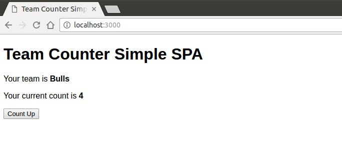

# HSR.Lab.Web.SimpleSPA

A simple SPA based on Handlebars.

This really simple proof of concept shows whats needed to implement a `Single Page App` without a framework like Angular or Aurelia.



## Features

* Templating (Handlebars)
* Click event handlers
* AJAX Service
* MVM
* Simple routing


## Why is it implemented in one file?

This is of purpose of demo and the posibility to send it easy by mail.


## Start it

```bash
node server.js
# or
npm start
```
Go to `http://localhost:3000`. You will be joined to a team. There are two teams and the server will join you to one of them.
